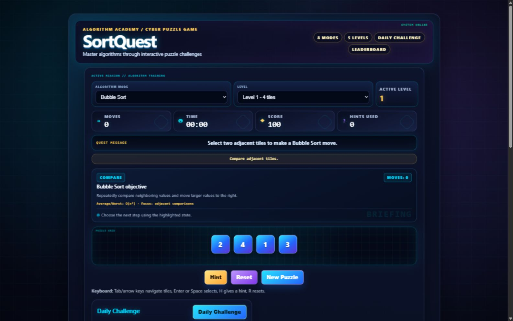
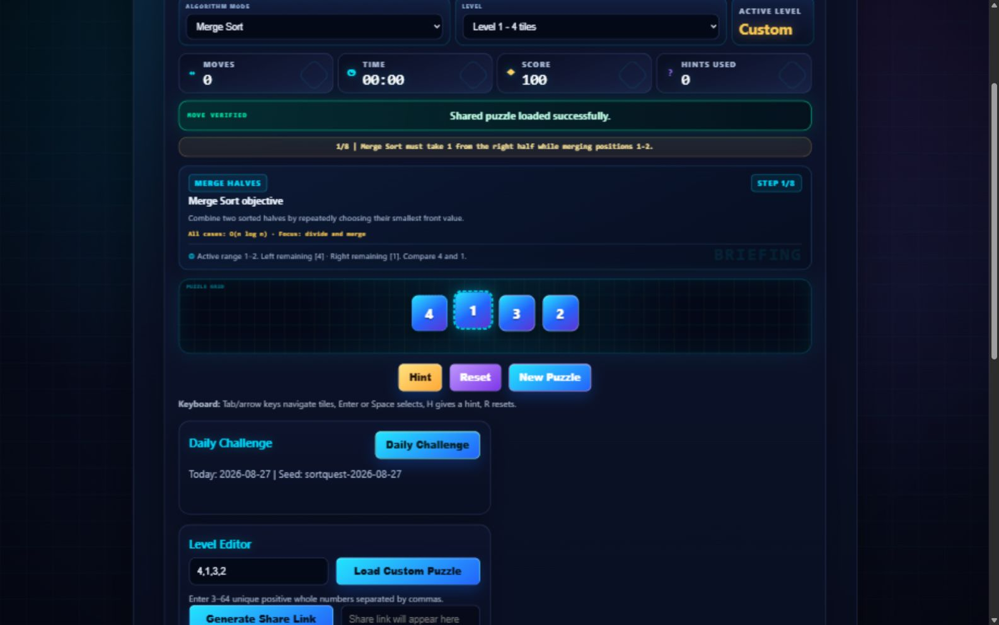
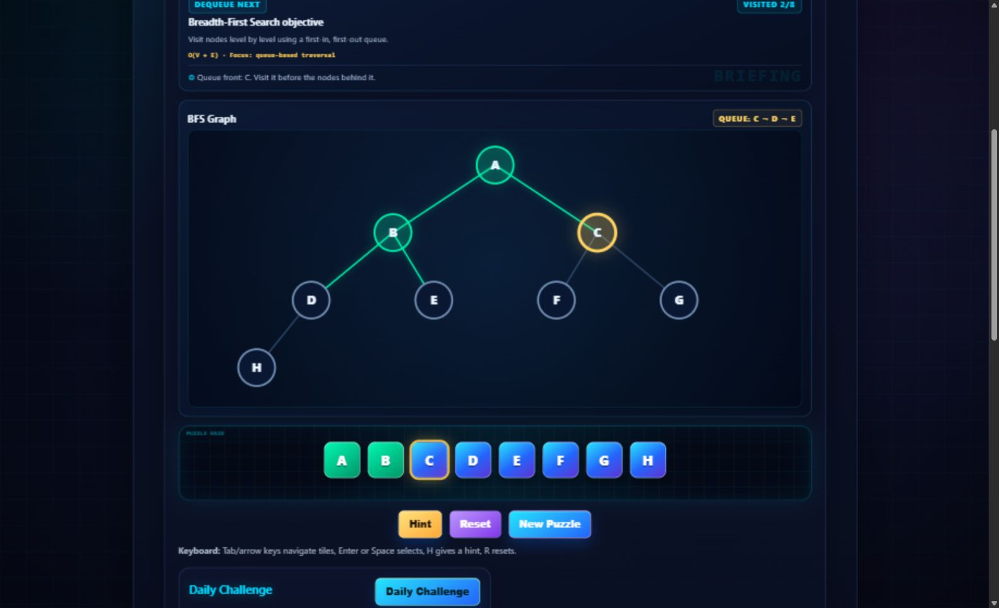
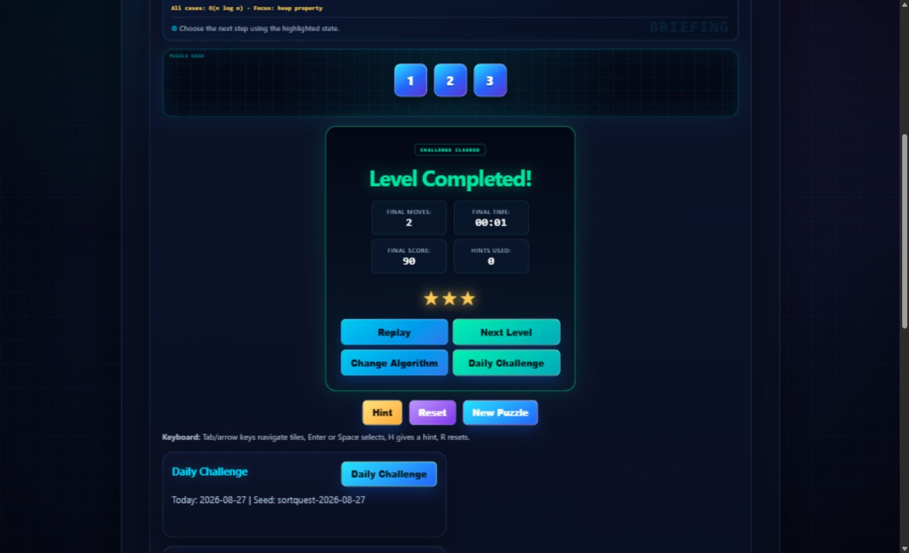
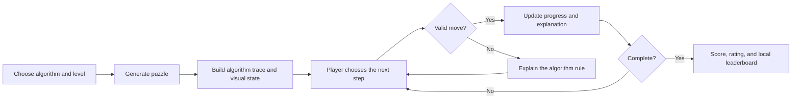

# SortQuest

**Learn algorithms by solving their steps — not just watching animations.**

SortQuest is an interactive algorithm-learning puzzle for sorting, searching, and graph traversal. Instead of passively replaying an animation, you predict the next valid algorithmic move, receive contextual feedback, and use progressive hints when you get stuck.

[**Play the Live Demo**](https://muhittinefekilic.github.io/sortquest-algorithm-visualiser/)




## Why SortQuest?

Traditional algorithm visualizers usually show the solution from start to finish. SortQuest makes the learner participate: every step is a decision checked against the active algorithm state.

- Solve interactive puzzles instead of watching a passive playback.
- See the current merge range, pivot, heap state, binary-search interval, or BFS queue.
- Learn from concise explanations after correct and incorrect choices.
- Reveal help gradually through three-stage hints.
- Create custom puzzles, share them through URLs, and return for a deterministic daily challenge.

## See SortQuest in Action

### Solve algorithm steps

Merge Sort exposes the active range, remaining left and right halves, current comparison, and meaningful step progress.



### Understand traversal state

BFS renders nodes and edges derived from the current puzzle, including visited nodes, the active node, and live queue order.



### Complete challenges and improve

Every completed puzzle summarizes moves, time, score, hints, and rating, with clear replay and progression actions.



## Supported Algorithms

| Mode | Learning focus |
| --- | --- |
| Bubble Sort | Adjacent comparisons and inversion removal |
| Selection Sort | Finding the minimum in the unsorted suffix |
| Insertion Sort | Growing a sorted prefix by positioning the current key |
| Merge Sort | Combining sorted halves within an active merge range |
| Quick Sort | Pivot selection, partition regions, and pivot placement |
| Heap Sort | Max-heap extraction, root/child relationships, and the sorted tail |
| Binary Search | Midpoint checks and repeated search-range elimination |
| Breadth-First Search | Queue-based, level-order graph traversal |

## Key Features

- Algorithm-specific puzzle validation and contextual feedback
- Progressive three-stage hints for every supported mode
- Merge, Quick, Heap, Binary Search, and BFS state visualization
- Responsive layouts with localized scrolling for dense visualizations
- Keyboard navigation with Enter, Space, arrow-key, `H`, and `R` controls
- Focus-visible, live-region, reduced-motion, and semantic interaction support
- Five difficulty levels from 4 to 64 values
- Deterministic daily challenges and local leaderboards
- Validated custom puzzles and shareable URLs with safe fallbacks
- Resilient browser-local persistence
- No backend, account, or production build step required

## How It Works



## Usage

1. Choose an algorithm and difficulty level, or load a custom puzzle.
2. Read the active objective and predict the next valid step.
3. Select tiles by pointer or keyboard.
4. Use progressive hints when needed; hints reduce the score.
5. Complete the challenge, replay it, advance a level, or try the daily challenge.

## Keyboard and Accessibility

| Control | Action |
| --- | --- |
| Arrow keys | Move focus between puzzle tiles |
| Enter / Space | Select the focused tile |
| `H` | Request a hint outside form controls |
| `R` | Reset the current puzzle outside form controls |

SortQuest includes visible focus states, semantic labels, polite live feedback regions, non-color status cues, and reduced-motion support. These features improve baseline accessibility but do not represent a formal accessibility certification.

## Local Development

Requirements: a current Node.js release and npm.

```bash
npm install
npm run dev
```

Open `http://127.0.0.1:4173`. Because the application uses ES modules, opening `index.html` through `file://` is not the recommended development workflow.

Run all unit and browser smoke tests:

```bash
npm run test:all
```

Individual commands: `npm test` and `npm run test:browser`.

## Technical Architecture

SortQuest is a framework-free, client-side application built with semantic HTML, CSS, and vanilla JavaScript ES modules. It remains deployable as static files on GitHub Pages.

- `script.js` coordinates UI rendering and game state.
- `js/algorithms.js` contains testable algorithm and traversal helpers.
- `js/puzzle-utils.js` handles validation, URL state, deterministic challenges, and stored-data parsing.
- Browser persistence uses isolated `localStorage` keys; there is no remote database.
- Node's built-in test runner covers pure logic; Playwright verifies real desktop and mobile interactions.

## Project Structure

```text
.
├── docs/images/             # Product and portfolio screenshots
├── js/
│   ├── algorithms.js        # Pure algorithm and traversal helpers
│   └── puzzle-utils.js      # Puzzle, URL, daily, and storage helpers
├── test/
│   ├── browser/             # Playwright smoke tests
│   ├── algorithms.test.js
│   └── puzzle-utils.test.js
├── tools/serve.mjs          # Minimal local static server
├── index.html
├── script.js
├── style.css
├── package.json
└── playwright.config.js
```

## Verified Engineering Checks

| Check | Latest result |
| --- | --- |
| Node unit tests | 12 passed, 0 failed |
| Playwright smoke tests | 4 passed, 0 failed |
| Desktop and mobile browser verification | Passed |
| Tested responsive widths | 320, 375, 768, 1024, and 1440 px |

These checks cover representative puzzle, validation, keyboard, URL, graph, and responsive flows; they are not a claim of exhaustive formal verification.

## Deployment

The repository root is the deployable site. GitHub Pages can serve the HTML, CSS, JavaScript, and ES modules directly—no production build command or backend is required.

Live deployment: [muhittinefekilic.github.io/sortquest-algorithm-visualiser](https://muhittinefekilic.github.io/sortquest-algorithm-visualiser/)

## Limitations

- Merge, Quick, and Heap use trace-driven progression rather than fully mutating the displayed array after every internal operation.
- Heap relationships do not yet have a dedicated tree SVG.
- The BFS graph is intentionally deterministic and tree-shaped.
- Leaderboards are local to the current browser and are not shared globally.
- Sixty-four-value puzzles are visually dense on small screens.

## Roadmap

- A dedicated heap-tree visualization
- Richer intermediate animation for trace-driven modes
- Additional graph shapes and algorithms
- An optional shared leaderboard service
- Continuous integration for the existing test suites

## License

SortQuest is available under the [MIT License](LICENSE).
